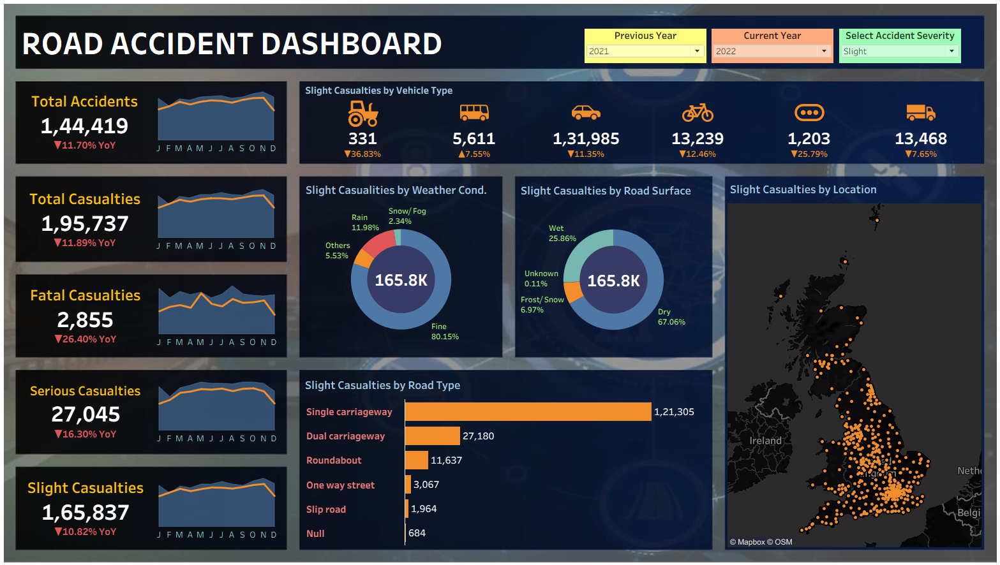
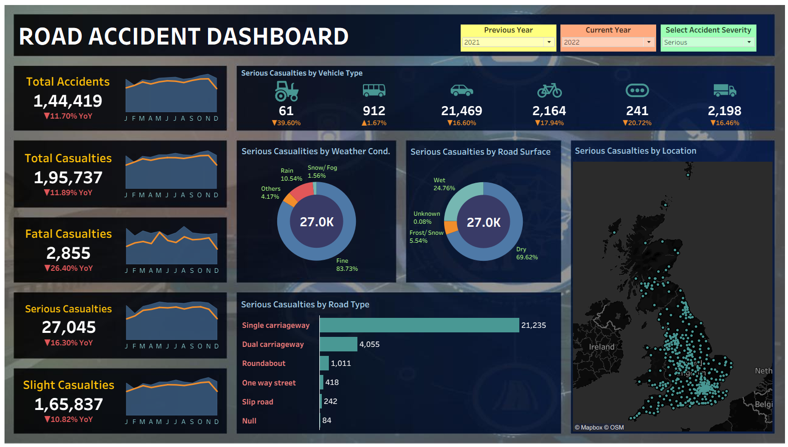
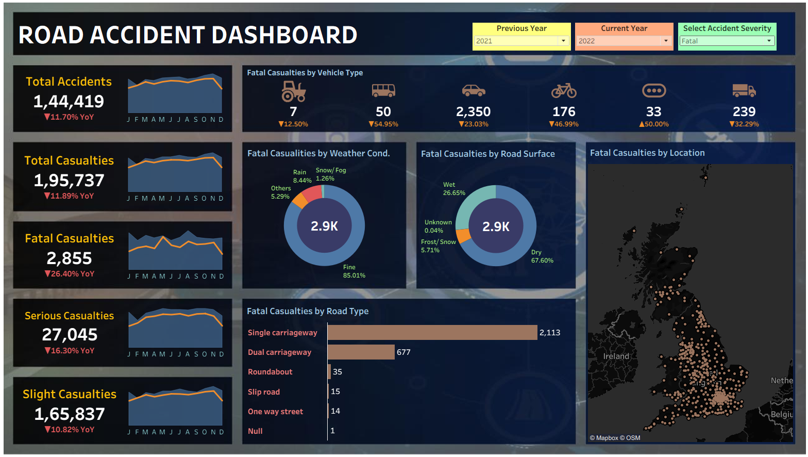

# 🚦 Road Accident Dashboard using Tableau

## 📌 Project Overview

This project presents an interactive Tableau dashboard designed to analyze road accident data and uncover patterns related to accident severity, time, and location. The dashboard helps visualize accident trends and provides insights that can support road safety initiatives and decision-making.

---

## 🎯 Objectives

* Analyze road accident trends and patterns.
* Study the distribution of accidents by severity level.
* Identify high-risk locations and time periods.
* Provide interactive visualizations for data exploration.
* Support data-driven road safety improvements.

---

## 🛠 Tools and Technologies Used

* **Tableau**
* **CSV Dataset**
* **Data Visualization**
* **Data Cleaning and Preparation**

---

## 📊 Dashboard Features

* Interactive filters and parameters
* Severity-wise accident analysis
* Time-based accident trends
* Location-based analysis
* Comparative visualization of accident categories
* KPI cards for quick insights

---

## 🖼 Dashboard Screenshots

### 📊 All Accidents Dashboard

Provides an overall view of road accidents including accident trends, severity distribution, and key metrics.

---

### 🟢 Slight Accidents Dashboard

Focuses on accidents classified as **Slight**, helping identify common patterns and contributing factors.

---

### 🟠 Serious Accidents Dashboard

Analyzes accidents with **Serious** severity to understand high-risk conditions and accident hotspots.

---

### 🔴 Fatal Accidents Dashboard

Highlights **Fatal** accidents for deeper analysis of the most severe incidents and their possible causes.

---

## 📁 Repository Contents

| File                           | Description                                                              |
| ------------------------------ | ------------------------------------------------------------------------ |
| `Road Accident Dashboard.twbx` | Tableau packaged workbook containing dashboards, worksheets, and dataset |
| `Screenshot1.png`              | All Accidents Dashboard                                                  |
| `Screenshot2.png`              | Slight Accidents Dashboard                                               |
| `Screenshot3.png`              | Serious Accidents Dashboard                                              |
| `Screenshot4.png`              | Fatal Accidents Dashboard                                                |
| `README.md`                    | Project documentation                                                    |

---

## 📈 Key Insights

* Slight accidents constitute the majority of total reported accidents.
* Serious and fatal accidents occur less frequently but require focused analysis.
* Accident occurrence varies significantly across different locations and time periods.
* Interactive filtering allows users to explore accident patterns effectively.

---

## 📥 Tableau Workbook

The complete Tableau project, including dashboards, worksheets, and dataset, is available in:

`Road Accident Dashboard.twbx`

---

## 👩‍💻 Author

**Priyanshi Gupta**
B.Tech CSE (Data Science)
Noida Institute of Engineering and Technology (NIET)

---

## ⭐ If you found this project useful, consider giving it a star!
